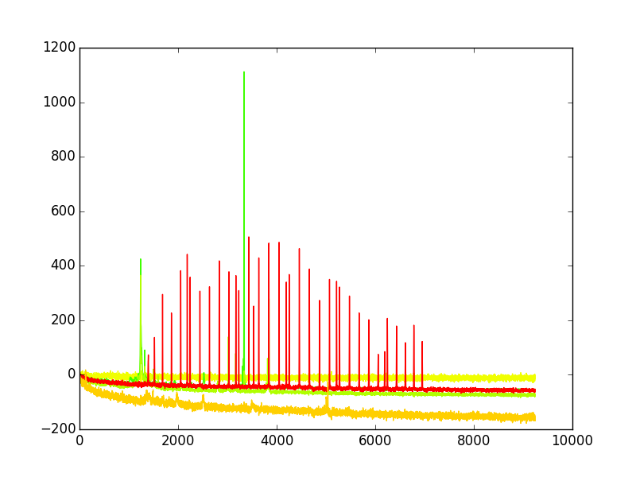
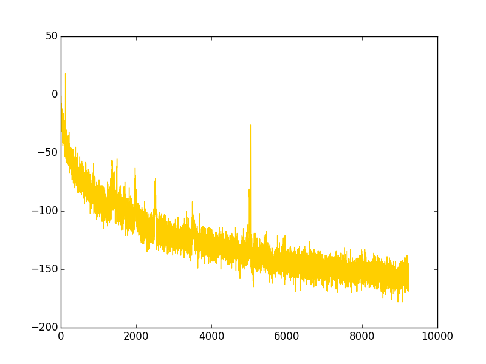
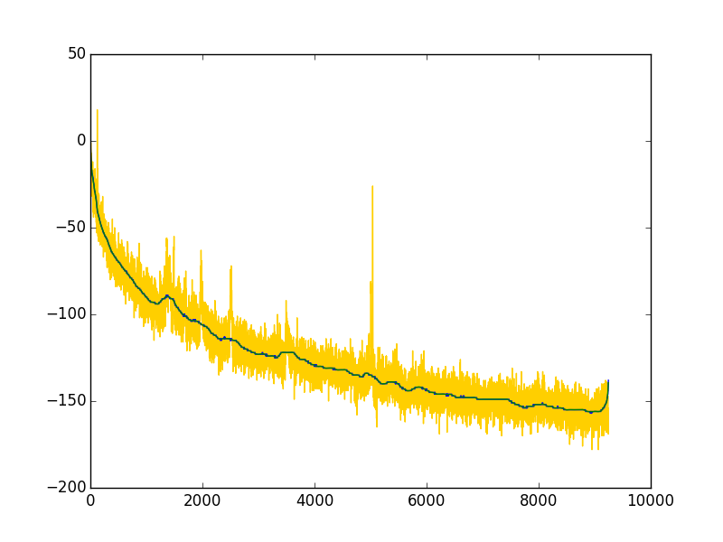
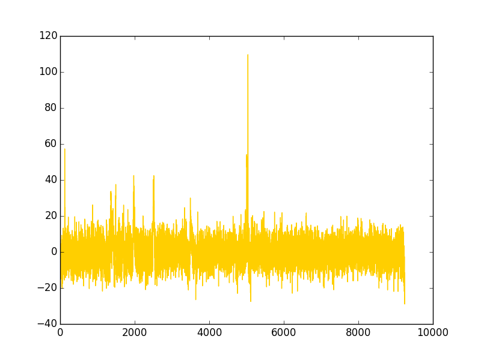
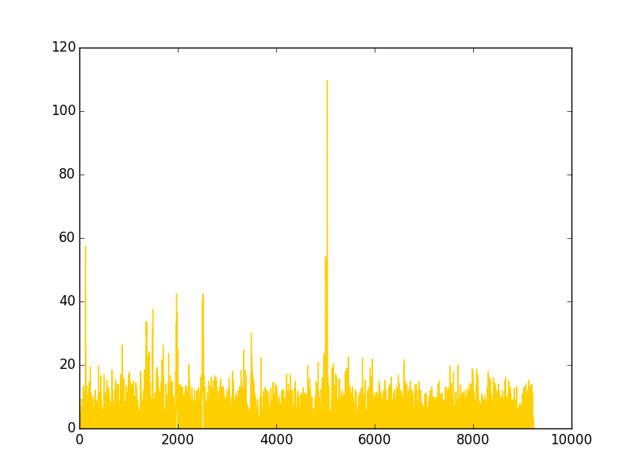
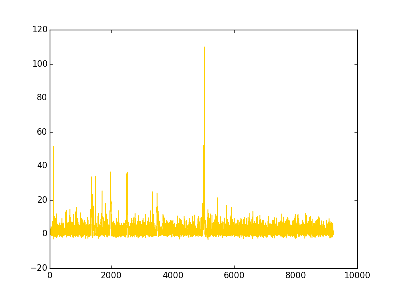
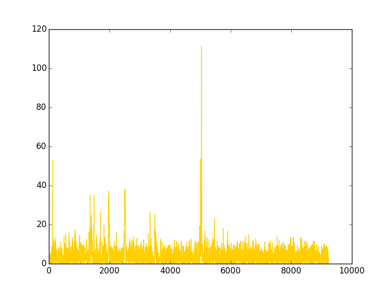

.. VivaxGEN Guides documentation master file, created by
   sphinx-quickstart on Thu Sep 29 18:08:16 2016.
   You can adapt this file completely to your liking, but it should at least
   contain the root `toctree` directive.

==============================
GUIDE ON FSA FRAGMENT ANALYSIS
==============================

.. toctree::
   :maxdepth: 2

This document provides a summary of the fragment analysis process performed by |plasmogen|.

INTRODUCTION
%%%%%%%%%%%%

Fragment analysis is a process to analyze the eletropherograms obtained from a capillary sequencing machine in the form of FSA file to determine the length (in bp) of the DNA fragments that are being genotyped.

FRAGMENT ANALYSIS PROCESS
%%%%%%%%%%%%%%%%%%%%%%%%%

Separation of Electropherograms
-------------------------------

The fragment analysis process starts by separating the electropherograms in the FSA files into separate channels for each dye/marker combination.
An example of multi channel FSA files is illustrated below (taken from FSA file 2014-01-06_mix-06012014_PBM-10156-10A.fsa).

Normalization of Baseline
-------------------------

Sometimes the electropherogram have a curved (non-flat) baseline as illustrated below.

The baseline needs to be corrected and transformed into flat baseline so that the real heights of all peaks can be obtained correctly.

For the first step, |plasmogen| will perform a median filter to the electropherogram with window size of 299.
The resultant line will then be smoothed by Savitsky-Golay filter with window size of 299 and polyorder of 7.
The smoothed original baseline is illustrated in the following figure.

The smoothed original baseline then is used to substract the original electropherogram, to obtain a new electropherogram with flatter baselinse.

All values below 0 then be cut off to obtain another electropherogram.

Another smoothing with Savitsky-Golay with window size of 11 and polyorder of 7 is then performed to obtain a smooth trace.

Lastly, a tophat morphological mathematical transform is applied to the trace to enhance other features that may have been missed by the previous procedures to produce the final smoothed, baseline-corrected trace.

.. |plasmogen| replace:: VivaxGEN

Indices and tables
==================

* :ref:`genindex`
* :ref:`modindex`
* :ref:`search`

