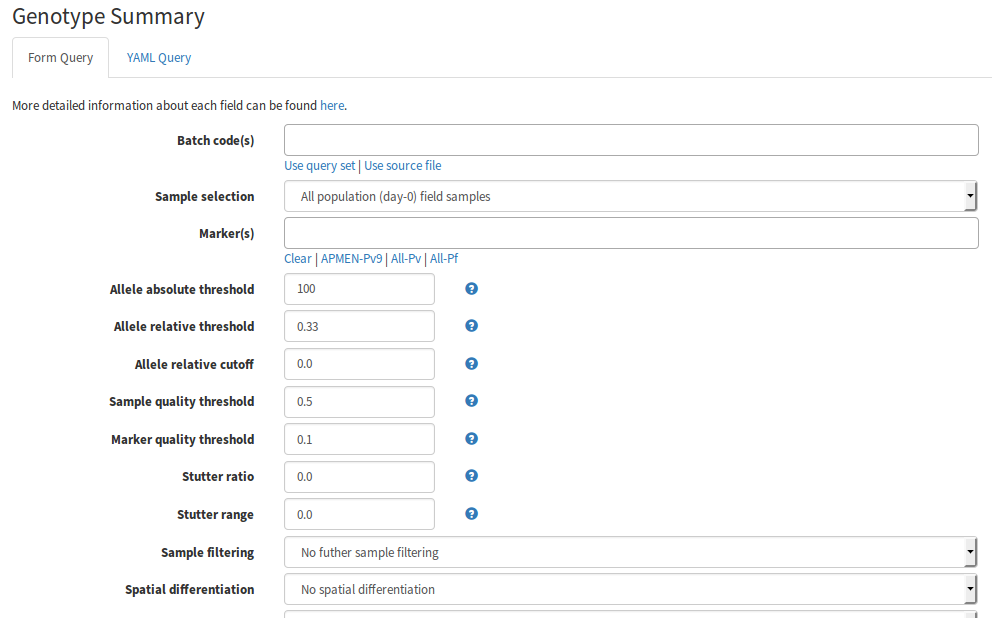
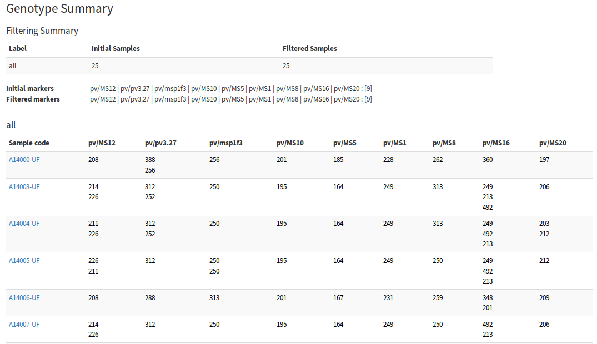
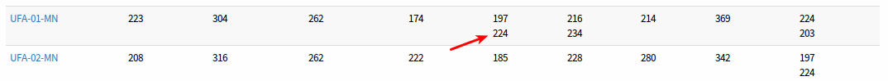
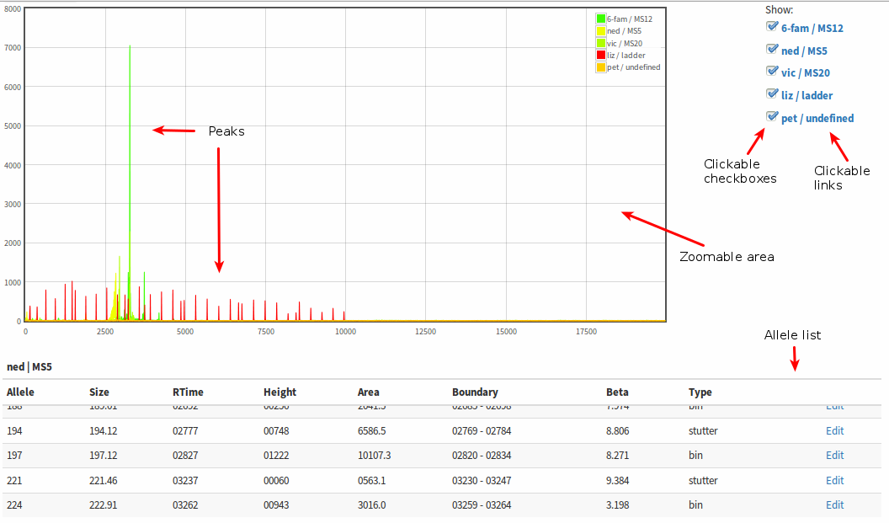
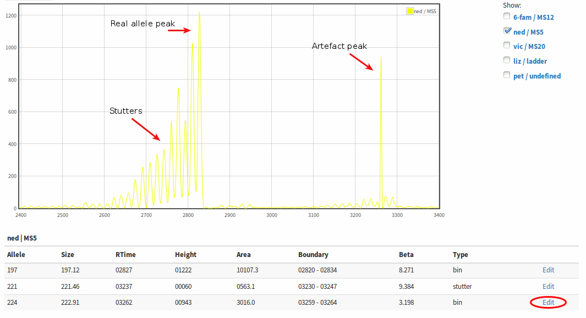
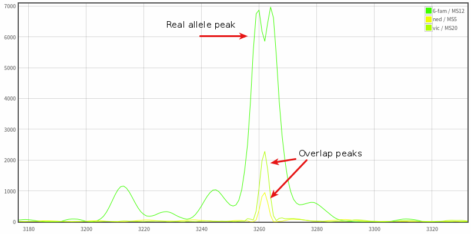
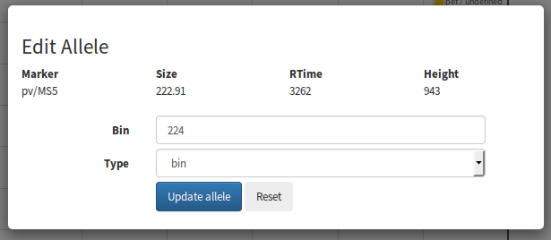

=========================================
TUTORIAL 2 - MICROSATELLITE DATA CLEANING
=========================================

.. contents::
.. sectnum::

This tutorial provides step-by-step instructions on how to perform data cleaning to exclude peaks such background noise, artefacts or stutter.
The fragment analysis process in VivaxGEN provides the first layer of data cleaning from the raw FSA files.
Several algorithms, described further in the *Integrated Fragment Analysis Tools* section of the manuscript, perform automated annotation of peaks as either bin peaks (real alleles) or non-binned peaks such as stutter and artefacts, which are excluded from further data analysis.
However, some peaks may not be annotated correctly by the algorithms, especially in challenging FSA files such as those containing low intensity peaks or extensive background noise.
The VivaxGEN platform therefore provides tools for inspecting the raw electropherogram traces to cross-check the automated annotations, and to manually re-annotate peak definitions where needed.
As the tutorial requires uncleaned data, you will need to use the new sample batch that you created and processed in Tutorial 1.

Inspecting Peaks
----------------

We will start by inspecting the summary of all genotyped peaks (i.e. all peaks defined as true alleles by the automated fragment analysis algorithms) in the data set using the Genotype Summary tool.
Select the **Genotype Summary** entry from the **Analyze** drop-down menu.
This will take you to a web page with a form for selecting the sample batch and markers, and for sample and marker filtering according to a number of parameters described further in the *Tools for Allele and Sample Filtering* section of the manuscript.
A snapshot of the form is provided in the figure below.

In the **Batch code(s)** field, select the new, uncleaned batch that you created in Tutorial 1. The samples in the Tutorial 1 batch were genotyped at the 9 APMEN *P. vivax* markers (see `reference`_ ) -   click on the **APMEN-Pv9** link to select these markers.
This will populate the **Marker(s)** field with the appropriate markers.
In this step of the tutorial, we will leave all other parameters as default.
Note that the default value of the **Allele absolute threshold** is set to 100 relative fluorescence units (RFU) i.e. all peaks with RFU less than 100 will be excluded even if they were binned by the automated algorithm.
Select **Execute** to perform the analysis. Once complete, a *Genotype Summary* report will be provided as illustrated in the figure below.

.. _reference: http://www.ncbi.nlm.nih.gov/pubmed/26627892

If we look closely at the results, we will see that there are sample/marker combinations that have multiple alleles.
For example, there are multiple alleles in many of the samples at markers **MS12** and **MS16**.
The multiple alleles within sample/marker combinations are sorted by their heights.
In some cases, all of the alleles may be real, reflecting multiple clone infections in which different clones have different alleles.
However, in some cases, one or more of the alleles may reflect peaks from noise, stutter, overlap or other artefacts that were not correctly annotated by the automated fragment analysis algorithms.
*Please note that the VivaxGEN platform is under constant development to improve features such as the fragment analysis peak annotation and  the results of the automated fragment analysis peak annotation may differ slightly between different versions of the platformwhen this tutorial was written*.

Inspecting Traces and Re-annotating Peaks
-----------------------------------------

To aid judgment of whether a given peak reflects a true allele, we need to inspect the original electropherogram trace in the FSA file.
We can do this using the FSA Viewer, which can be accessed directly by clicking on an  allele of interest.

As an example, locate sample UFA-01-MN as indicated above, and open the trace view for allele 224 of MS5 marker by clicking on 224 using the right mouse button and selecting open link in new tab.
The trace view should look similar to the figure below.

The view consists of the electropherogram trace from the FSA file and a summary of allele peaks and associated annotations below.
We can zoom in on the trace by selecting an area using the mouse.
To the right of the trace is a panel containing checkboxes which allow the user to turn specific markers/dyes on or off.
Clicking on the dye or marker name will scroll the allele list to the designated dye/marker.

As an example, turn off all dyes/markers except MS5 and zoom in on the trace to the area around 2400 - 3400 retention time to generate a view similar to the figure below.

Note that the peak underlying allele 224 at retention time ~3262 has a very narrow base uncharacteristic of the alleles for this marker.
The *beta* value (height divided by width) of this peak is 3.2, whereas most real alleles have beta of 5-10.
Moreover, the peak is not accompanied by small stutter peaks or widening areas close to baseline that usually form around real allele peaks.
If we switch the other markers (**MS12** and **MS20**) back on and zoom back into the region, we can see that the MS5 224 allele is overlapped by a large MS12 peak and is therefore likely to be an overlap peak and not a true allele (as illustrated below).

We can manually re-annotate this peak as overlap peak (or any other annotation other than bin) to exclude it from further analyses.
To do so, click on the **Edit** link at the row of allele 224, which will bring up a pop up window as illustrated below.

From the pop-up window, we can change **Type** field from bin to overlap (or any other annotation other than bin) and then click **Update allele**.
The updated annotation will be saved.
We can then return to the Genotype Summary tab (or window), and click on **Resubmit analysis** on the top left of the page to get the updated result.
The allele 224 at MS5 marker from sample UFA-01-MN should not appear in the updated Genotype Summary.

Inspecting Alleles with Lower Absolute Threshold or Relative Threshold
----------------------------------------------------------------------

In many cases, false allele peaks may be excluded by adjusting the **Allele absolute threshold** and/or **Allele relative threshold**.
In the previous steps, we observed our data at the default **Allele absolute threshold** of 100 RFU.
To inspect the Genotype Summary at a lower threshold, we can change the value of the **Allele absolute threshold** and/or **Allele relative threshold** to lower values in the Genotype Summary form.
Note that the public batches available in VivaxGEN have all been cleaned to **Allele absolute threshold** of 40 RFU.

.. |plasmogen| replace:: VivaxGEN

