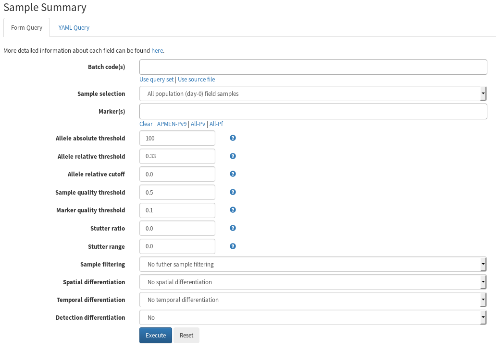
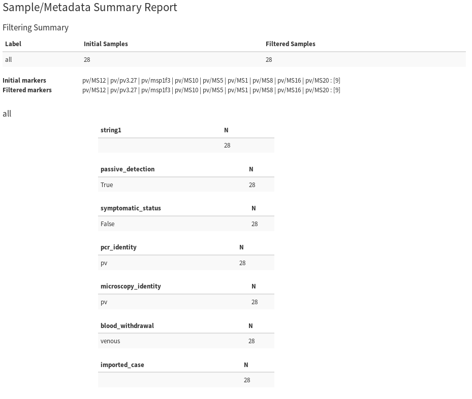
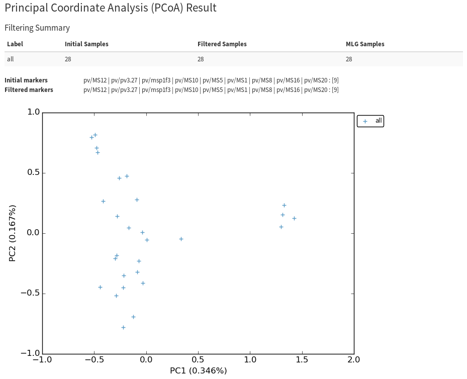
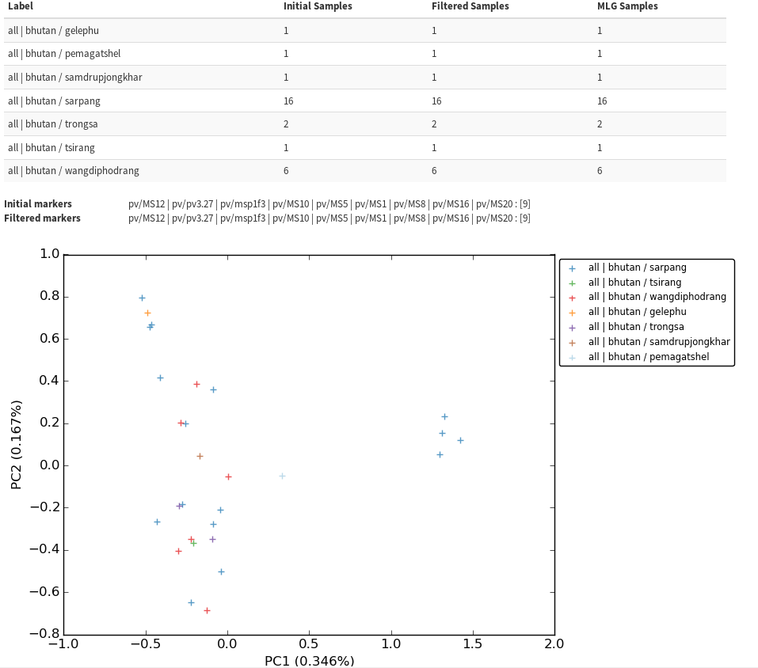
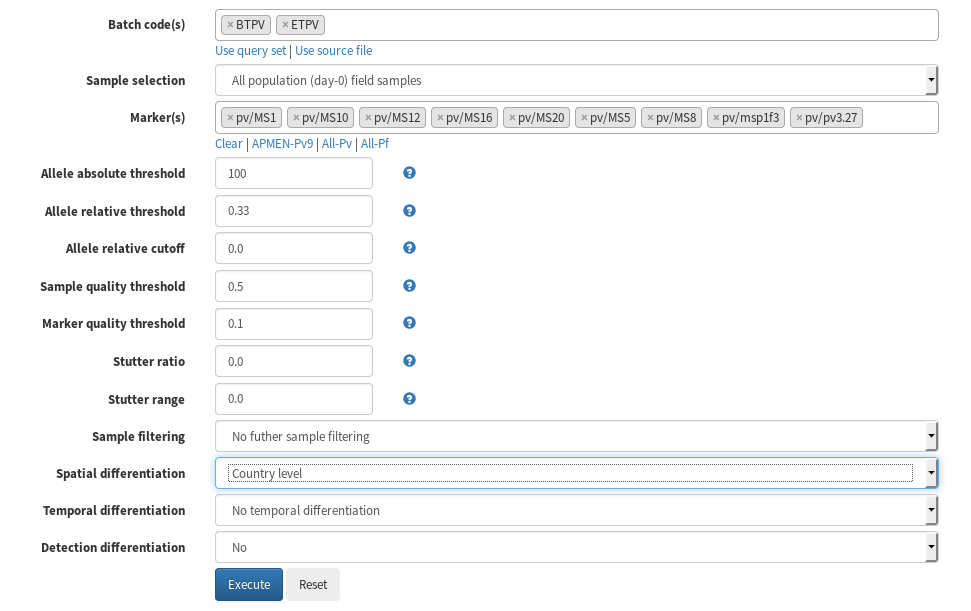
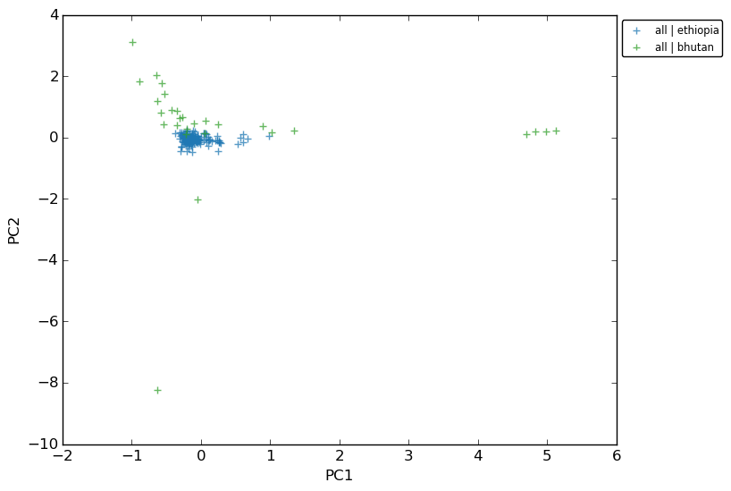

=============
DATA ANALYSIS
=============

.. contents::

This tutorial provides step-by-step instructions on how to perform data analyses using the form-based web interface.
The tutorial uses examples from the publically available batch BTPV, comprising microsatellite data on *P. vivax* isolates from patients in Bhutan (`1`_).

.. _1: http://www.ncbi.nlm.nih.gov/pubmed/27176722

Inspecting Sample Metadata
--------------------------

Before performing further analyses on batch BTPV, we will start by determining how many samples the batch has, and inspecting some features of the sample metadata.
For this step, we will use the *Sample summary* analysis tool.

Select the **Sample summary** entry from the **Analyze** drop-down menu, and a form similar to the figure below will appear.

To use the BTPV batch, select BTPV from the **Batch code(s)** field.
As we plan to analyze all independent samples in the batch (i.e. all day-0 samples), the **Sample selection** field should be left as default.
The samples in the BTPV batch were genotyped at the 9 APMEN P. vivax markers (`2`_), click on the **APMEN-Pv9** link to select these markers.
This will populate the **Marker(s)** field with the appropriate markers.

.. _2: http://www.ncbi.nlm.nih.gov/pubmed/26627892

As detailed in the *Tools for Allele and Sample Filtering* section of the manuscript, samples and markers can be filtered according to a number of parameters.
In this tutorial, we will use all of the default parameters.
Once the parameters have been set, select **Execute** to perform the analysis.
A snapshot of the report outlining the results of the sample summary query on the BTPV batch is illustrated in the figure below.

The following information is provided:

- There are 28 samples  in total (Initial Samples) in batch BTPV.

- After filtering samples and markers according to the parameters set in the prior step, there are 28 samples remaining (Filtered Samples) in batch BTPV and that have been included in the analysis.
  As defined in the default parameters, the dataset on the 28 Filtered samples only comprises samples with genotype calls for at least 50% of the total markers (i.e. 5 of the 9 markers), as the default value of **Sample quality threshold** is 0.5.
  As the default **Allele absolute threshold** was set to 100, genotype calls were only provided for alleles with relative fluorescence unit (RFU) >= 100.

- All 28 Filtered samples were collected by passive detection, without any symptomatic status, and had been identified as *P. vivax* by both PCR and microscopy.
  All blood samples were collected by venous withdrawal.

- The patient donors included 16 Indian nationals and 12 Bhutanese nationals.
  Three of the patients were female and 25 were male.

PCoA Cluster Plot
-----------------

In this tutorial step, we will review the steps for performing Principal Coordinate Analysis (PCoA) in the BTPV batch as an example on how to apply one of the platform’s suite of standard population genetic tools using the form-based web interface.

Select the **Principle Coordinate Analysis (PCoA)** entry from the **Analyze** drop-down menu.
A form similar to that used for inspecting the sample metadata will be provided to enable sample and marker filtering as required.
Note that the sample and marker filtering form is available for all analyses within the |plasmogen| platform.

Fill the form as before:

- Use **Batch code(s)** BTPV

- Use **Markers(s)** APMEN-Pv9

- Leave all other fields as default

When the form has been filled, select **Execute** to run the analysis.
The results output should provide a PCoA cluster plot similar to the figure below.
This is the simplest form of analysis, with minimal annotation by metadata details such as spatial and temporal parameters.

Note that PCoA can only be performed on samples with genotype calls for all markers selected (i.e. with complete multi-locus genotypes - MLGs).
The Filtering Summary in the results output provides sample numbers for Initial Samples, Filtered Samples, and  samples with complete MLGs (MLG Samples).

PCoA Cluster Plot with Sample Grouping by Spatial Differentiation
-----------------------------------------------------------------

In this tutorial step, we will further explore the PCoA cluster plot in batch BTPV by overlaying more details on spatial differentiation.
Return to the Principle Coordinate Analysis (PCoA) entry and  use the same parameters as in step 2 except for the **Spatial differentiation** field – here, select *1st Administration level*.
When the form has been filled, select **Execute** to run the analysis.
As illustrated in the figure below, a similar cluster plot to step 2 should be produced but with annotation on spatial differentiation at the 1st Administrative level.
With the extra colour-coded spatial annotation, we can now see that the 4 samples which separated from the others on PC1 were all collected from Sarpang District.

Note that the Filtering Summary now provides details on sample numbers by 1st Administration level.

MCA Cluster Plot with Multiple Batches
--------------------------------------

A more interesting question that can be inferred by cluster plot is comparing samples from different bigger regions such as countries, which can be done by using multiple batches from different countries.
In this tutorial step, we will use Multiple Correspondence Analysis (MCA) which is another method of getting cluster plot.

Select the Multiple Correspondence Analysis (MCA) entry from the **Analyze** drop-down menu.
A familiar form will be shown.
However, instead of just selecting BTPV batch in the **Batch code(s)** field, add another batch by selecting ETPV batch which contains samples from Ethiopia.
We also need to select *Country level* for **Spatial differentiation** field so that we will know which samples come which countries.
The completed form will look similar to the following figure.

The reason we are confident in mixing BTPV and ETPV is that both batches were genotyped using APMEN 9 *P. vivax* markers, and both used LIZ600 standard size.

Once the MCA analysis finishes, we will obtain a plot similar to the following figure.

We can see from the result that the sample size from Ethiopia is much bigger than from Bhutan.
Despite of this, the Bhutan cluster is more dispersed compared to the the much tight Ethiopia cluster.
In molecular term, we can infer that the Bhutan samples have higher diversity relative to the Ethiopia samples.
Please note that there are other methods that can be used to check and confirm these diversities, such as **Heterozygosity** analysis.

.. |plasmogen| replace:: VivaxGEN

