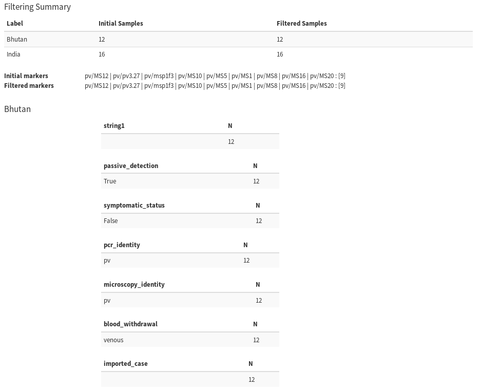

============================================
TUTORIAL 4 - DATA ANALYSIS WITH CUSTOM QUERY
============================================

.. contents::
.. sectnum::

In this tutorial, we will review the steps for performing  data analysis using the custom query tools.
The custom query tools may be required for analyses that cannot be performed using the existing drop-down options in the form-based query tools available on VivaxGEN.
For example, if we are interested in only using samples from certain geographical areas that cannot be  selected using the form-based web tools discussed in Tutorial 3.
The custom query tools in VivaxGEN are modelled on the NCBI Entrez system, which uses the following syntax: ::

   value[FIELDNAME]

For demonstration purposes, we will use the BTPV batch again for this tutorial.
Recall from Tutorial 3 that the samples in the BTPV batch have the following values in the **nationality** field: india and bhutan.
We will review the custom query steps to differentiate the BTPV samples by the nationality field  in Principal Coordinate Analysis (PCoA).

Using the Custom Query Form
---------------------------

As a start, let’s review the BTPV sample summary after differentiation by the nationality field.
Select the **Sample summary** entry from the **Analyze** drop-down menu.
Next, instead of selecting the batch code as in Tutorial 3, click on the Use query set link just below the **Batch code(s)** field.
The **Batch code(s)** field will change to a **Query set** field as illustrated in the following figure.

Write or copy the query statement below into the **Query set** field: ::

  BTPV[batch] !! india[nationality] >> India $ bhutan[nationality] >> Bhutan

Note, in simple terms, the above query statement essentially makes the following commands:

* use samples from the BTPV batch: "``BTPV[batch]``""
* create a sample set labelled *India* from the samples that have value *india* in the **nationality** field: "``india[nationality] >> India``"
* create another sample set labelled *Bhutan* from the samples that have bhutan in the nationality field: "``bhutan[nationality] >> Bhutan``"
* the double exclamation symbol ``!!`` indicates that the former statement will apply to all sample set, so in this case all the sample set must come from BTPV batch
* the dollar sign ``$`` is the sample set separator
* the ``>>`` sign indicates the label string

In summary, the above query statement performs re-grouping of  the samples in batch BTPV by nationality, enabling comparison of samples from Indian versus Bhutanese nationals.

After adding the query statement, as in Tutorial 3, select the **APMEN-Pv9** marker set in the **Marker(s)** field, and leave the other parameters as default as illustrated in the figure below.
Select **Execute** to perform the analysis.

A snapshot of the report outlining the results of the customized sample summary query is illustrated in the figure below.

As defined in the custom query statement, the results are reported for each of the Indian and Bhutanese nationality sample sets, labelled *India* and *Bhutan* respectively.

Performing Principal Coordinate Analysis using a Custom Query
-------------------------------------------------------------

In this step of the tutorial, we will generate a PCoA cluster plot on the BTPV batch with differentiation by nationality.
Select the **Principle Coordinate Analysis (PCoA)** entry from the **Analyze** drop-down menu.
As in step 1, click on the **Use query set** link, and add the query statement from step 1.
Select the **APMEN-Pv9** marker set, leave the other parameters as default, and then select Execute.

The results output should provide a PCoA cluster plot with colour-coded differentiation of the samples by nationality as in the figure below.

.. |plasmogen| replace:: VivaxGEN

