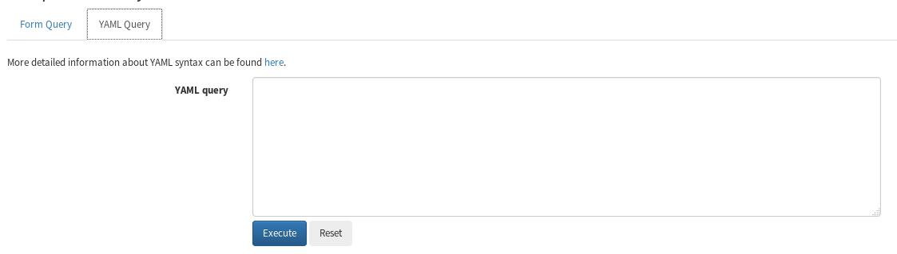

==============================
DATA ANALYSIS WITH YAML FORMAT
==============================

.. contents::

In this tutorial, we will review options for performing data analysis in VivaxGEN using the YAML text format.
Note, most users will not need to use the YAML text format – options are provided for more advanced users performing bulk analyses.
As stated in the `official YAML website`_, YAML is *a human friendly data serialization standard for all programming languages*.
YAML is a text format that computers can parse and that users can edit and read easily.
The YAML format for querying VivaxGEN may be useful to save time where a user needs to perform multiple analyses using different tools with similar queries.
In this case, the user can copy and paste the YAML query into the YAML query set, save the query for future use, or for sharing with other users to ensure consistent parameters (and consistent results).

A Glance of YAML Format
-------------------------

An example of YAML format for |plasmogen| is shown below (please note that the indentation of the text is important): ::

  selector:
    Bhutan:
      - { batch: BTPV }

  filter:
    markers: [ MS1,MS10,MS12,MS16,MS20,MS5,MS8,msp1f3,pv3.27 ]
    abs_threshold: 50
    rel_threshold: 0.33
    rel_cutoff: 0
    sample_qual_threshold: 0.1
    marker_qual_threshold: 0.1
    sample_option: A
    peak_type: [binned]
    stutter_ratio: 0.5
    stutter_range: 3.5

  differentiator:
    spatial: -1
    temporal: -1

The ``selector`` section indicates the sample set that the user wants to create.
The above query essentially states that we want to create 1 sample set labelled “Bhutan” which will contain samples from the BTPV batch.

The ``filter`` section controls the parameters used to perform sample, marker and allele filtering.
The options are similar to the form-based web fields.

The ``differentiator`` section indicates the type of sample differentiation that the user would like to perform on the samples.
In the above query, we do not use any differentiation and so we use `-1` for all parameter values.

Using YAML Query
-----------------

To use the YAML format as a query, for example to prepare a *Sample summary*, we need to click on the **YAML Query** navigation tab which will change the web form to a simple form as illustrated below.

The YAML text then needs to be pasted or directly written into the **YAML query** field.

For the tutorial, select the **Sample summary** entry from the **Analyze** drop-down menu, and paste the above example query into the **YAML query** field.
Select **Execute** to perform the analysis.
The result output should be similar to the output from section 1 in Tutorial 3.

Using YAML Query for Differentiation
------------------------------------

Next, we will perform the Principal Coordinate Analysis (PCoA) performed in section 4 of Tutorial 3 using the YAML query format.
The YAML query text that we need to use is shown below:

::

  selector:
    all:
      - { batch: BTPV }
      - { batch: ETPV }

  filter:
    markers: [ MS1,MS10,MS12,MS16,MS20,MS5,MS8,msp1f3,pv3.27 ]
    abs_threshold: 50
    rel_threshold: 0.33
    rel_cutoff: 0
    sample_qual_threshold: 0.5
    marker_qual_threshold: 0.1
    sample_option: A
    peak_type: [binned]
    stutter_ratio: 0.5
    stutter_range: 3.5

  differentiator:
    spatial: 0
    temporal: -1

Note that we have defined a single sample sets labelled *all*, and set ``spatial`` in ``differentiator`` with value of ``0`` for country (use ``1`` for 1st administrative level, ``2`` for 2nd administrative level, etc).

Once we execute the above query, we should get the same result as in section 4 of Tutorial 3.

Similary, we can perform the same analysis as in Tutorial 4 i.e. re-grouping the samples by nationality.
For this, we need the following query:

::

  selector:
    Bhutan:
      - { batch: BTPV, nationality: bhutan }
    India:
      - { batch: BTPV, nationality: india }

  filter:
    markers: [ MS1,MS10,MS12,MS16,MS20,MS5,MS8,msp1f3,pv3.27 ]
    abs_threshold: 50
    rel_threshold: 0.33
    rel_cutoff: 0
    sample_qual_threshold: 0.5
    marker_qual_threshold: 0.1
    sample_option: A
    peak_type: [binned]
    stutter_ratio: 0.5
    stutter_range: 3.5

  differentiator:
    spatial: -1
    temporal: -1

Note that we have defined two sample sets labelled *Bhutan* and *India*, with each sample set having a different nationality value but the same batch code.

If we execute the above query in PCoA tool, we should get similar result as in Tutorial 4.
Please note that PCoA and Multiple Correspondence Analysis (MCA) will perform *data jittering* which essentially add small noises to the actual data to prevent to prevent overlap of samples and, hence, different PCoA or MCA plots may look slightly different despite the same data set being applied.

.. _official YAML website: http://yaml.org
.. |plasmogen| replace:: VivaxGEN

